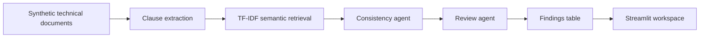

# LLM Agentes de Consistência Documental

## PT-BR

Projeto em Python para revisar consistência entre documentos técnicos usando uma arquitetura de agentes com três papéis:

- `retrieval agent`
- `consistency agent`
- `review agent`

O objetivo é encontrar cláusulas semanticamente parecidas, detectar conflitos estruturais e produzir um parecer final sobre a inconsistência.

### O que o projeto demonstra

- revisão documental assistida por agentes
- combinação de regras e LLM
- comparação entre modo determinístico e modo com LLM
- fluxo próximo de análise técnica, auditoria e governança documental

### Arquitetura



### Agentes

- `RetrievalAgent`
  encontra cláusulas semanticamente comparáveis.
- `ConsistencyAgent`
  identifica divergências de prazo, padrão técnico, responsabilidade e critério de medição.
- `ReviewAgent`
  consolida o parecer em dois modos:
  - `fallback`
  - `llm`

### Dados

O projeto usa documentos sintéticos com conflitos controlados, como:

- prazo `10` vs `15` dias
- padrão técnico `ENG-VAL-01` vs `ENG-VAL-02`
- responsabilidade `contractor` vs `client inspection team`
- medição por `isometric sheets` vs `bill of quantities`

Além dos documentos, o projeto mantém um `ground truth` explícito com:

- `8` pares de cláusulas comparáveis esperadas
- `5` inconsistências verdadeiras conhecidas
- `3` pares consistentes usados para medir falso positivo

Isso permite avaliar o pipeline de forma supervisionada, em vez de apenas contar achados.

### Métricas de avaliação

O projeto agora mede duas etapas separadamente:

- `retrieval`
  avalia se o agente de recuperação encontrou os pares corretos de cláusulas comparáveis.
- `consistency_detection`
  avalia se o agente de consistência marcou corretamente os conflitos esperados.

As métricas calculadas são:

- `precision`
- `recall`
- `f1`
- `tp`, `fp`, `fn`

### Resultados atuais

No modo `fallback`, a execução atual gera:

- `4` documentos
- `16` cláusulas
- `19` pares similares recuperados
- `16` inconsistências detectadas

Benchmark atual:

- `retrieval precision = 0.3684`
- `retrieval recall = 0.8750`
- `retrieval f1 = 0.5185`
- `consistency detection precision = 0.2500`
- `consistency detection recall = 0.8000`
- `consistency detection f1 = 0.3810`

Leitura técnica:

- o pipeline tem `recall` alto para encontrar pares relevantes
- mas ainda gera muitos pares extras, o que derruba a `precision`
- isso é útil para portfólio porque mostra um comportamento realista de sistemas agentic: boa cobertura, mas necessidade de refinar ranking, thresholds e validação final

### Técnicas e bibliotecas

- `pandas`
- `scikit-learn`
- `transformers`
- `peft`
- `streamlit`
- `plotly`

Técnicas usadas:

- extração de cláusulas com `regex`
- recuperação semântica com `TF-IDF` e `cosine similarity`
- detecção estruturada de conflito por regra
- revisão final com agente determinístico ou agente com `LLM`
- avaliação supervisionada com `ground truth`

### Como executar

```bash
python3 -m venv .venv
source .venv/bin/activate
pip install -r requirements.txt
python3 main.py
streamlit run app.py
```

Se você tentar rodar fora do ambiente virtual e faltar dependência, o `main.py` agora retorna uma mensagem explícita orientando a ativação do `.venv`.

---

## EN

Python project for reviewing consistency across technical documents with a multi-agent workflow composed of:

- `retrieval agent`
- `consistency agent`
- `review agent`

The goal is to find semantically similar clauses, detect structured conflicts, and produce a final review decision.
